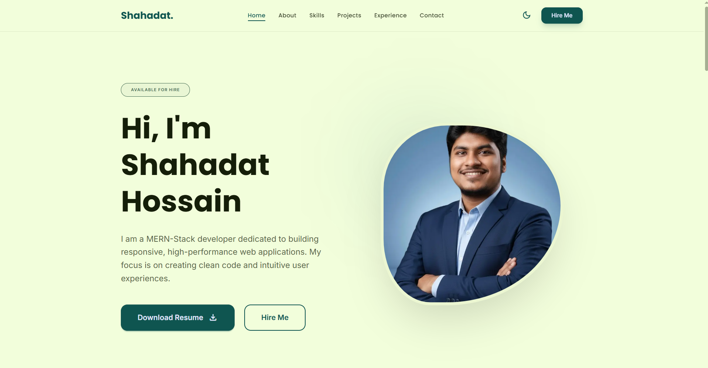
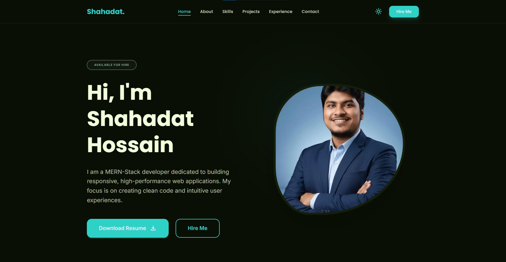
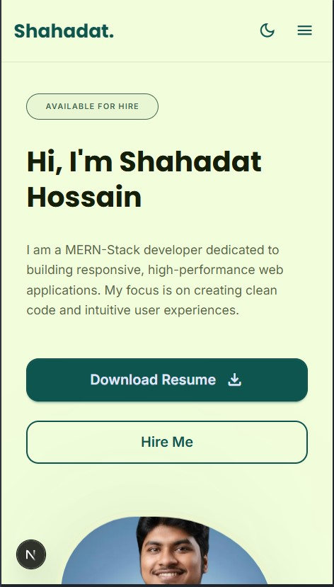

# 🧑‍💻 Shahadat Hossain — Portfolio

> **Clean code. Intuitive experiences. Built to impress.**
> A high-performance personal portfolio showcasing my projects, skills, and journey as a MERN-Stack developer.

[](https://nextjs.org/)
[](https://react.dev/)
[](https://tailwindcss.com/)
[](https://daisyui.com/)
[](https://www.framer.com/motion/)
[](https://shahadathossain.vercel.app)

---

## 📖 About

This is my personal portfolio website built with **Next.js 16** and modern web technologies. It features smooth animations, dark/light theme toggle, responsive design, and sections covering my projects, skills, and experience as a MERN-Stack developer.

The goal was to create a portfolio that doesn't just list things — but actually _feels_ like the kind of developer I am: clean, fast, and detail-oriented.

---

## 💡 Why This Portfolio?

Most developer portfolios are either too generic or too complex. I wanted something that:

- Loads blazing fast with Next.js App Router
- Looks polished on every device
- Reflects my real personality and work
- Has smooth, purposeful animations — not just flashy effects

Because your portfolio is often the first impression. It should speak for itself.

---

## ✨ Key Features

### 🎨 Dark / Light Theme Toggle

Seamlessly switch between dark and light mode. Theme preference is saved in `localStorage` and applied instantly on every visit — no flash of unstyled content.

### 🌀 Smooth Animations

Every section uses a combination of **Framer Motion** and **GSAP** for scroll-triggered animations, parallax effects, and fluid transitions that feel natural — not distracting.

### 📱 Fully Responsive

Built mobile-first. The layout adapts gracefully from small phones to ultra-wide desktops — including a mobile hamburger menu with dropdown navigation.

### 🗂️ Projects Showcase

Each project card features a live demo link, GitHub repo link, tech stack badges, and a hover overlay — making it easy for visitors to explore my work at a glance.

### 🧭 Active Section Tracking

The navbar automatically highlights the current section as you scroll, using the Intersection Observer API for smooth, accurate tracking.

### ⚡ Performance Optimized

- Next.js Image component with `fill` and `sizes` for optimized loading
- Font optimization via `next/font/google`
- Smooth scrolling handled by a dedicated `SmoothScroll` component

---

## 🛠 Tech Stack

| Technology                                         | Version | Purpose                                |
| -------------------------------------------------- | ------- | -------------------------------------- |
| [Next.js](https://nextjs.org/)                     | 16.2.4  | React framework & routing              |
| [React](https://react.dev/)                        | 19      | UI library                             |
| [Tailwind CSS](https://tailwindcss.com/)           | v4      | Utility-first styling                  |
| [DaisyUI](https://daisyui.com/)                    | v5      | UI component library                   |
| [Framer Motion](https://www.framer.com/motion/)    | v12     | Animations & transitions               |
| [GSAP](https://greensock.com/gsap/)                | v3      | Scroll-triggered animations & parallax |
| [Material Symbols](https://fonts.google.com/icons) | —       | Icon library                           |

---

## 🧠 What I Learned

Building this portfolio pushed me to think beyond just writing code:

- ⚡ Mastered **Next.js App Router** — layouts, metadata, font optimization
- 🎬 Combined **Framer Motion + GSAP** for complex, layered animations
- 🌗 Implemented a **flicker-free dark mode** without third-party libraries
- 📐 Built a truly **responsive layout** with Tailwind v4's new syntax
- 🧩 Structured a **scalable component architecture** for a real-world project
- 🖼️ Optimized images with Next.js `<Image>` component using `fill` and `sizes`

This project helped me level up from just building features — to crafting complete user experiences.

---

## 🚀 Getting Started

### Prerequisites

- Node.js 18+
- npm or yarn

### Installation

```bash
# Clone the repository
git clone https://github.com/shahadat-hossain99/portfolio.git

# Navigate into the project
cd portfolio

# Install dependencies
npm install

# Start the development server
npm run dev
```

Open [http://localhost:3000](http://localhost:3000) in your browser.

---

## 📁 Project Structure

```
portfolio/
├── public/
│   ├── favicon.ico
│   └── images/          # Project screenshots
├── src/
│   └── app/
│       ├── layout.js    # Root layout with fonts & metadata
│       ├── page.js      # Main page
│       └── globals.css
│   └── components/
│       ├── Navbar.jsx
│       ├── Hero.jsx
│       ├── About.jsx
│       ├── Skills.jsx
│       ├── Projects.jsx
│       ├── Experience.jsx
│       ├── Contact.jsx
│       ├── Footer.jsx
│       └── SmoothScroll.jsx
├── next.config.mjs
├── tailwind.config.js
└── package.json
```

---

## 🌐 Live Demo

🚀 Check out the live portfolio:

👉 **[shahadat-portfolio-999.vercel.app](https://shahadat-portfolio-999.vercel.app/)**

💡 Try this:

- Toggle between dark and light mode
- Scroll through sections and watch the animations
- Hover over project cards to see the overlay
- Check the active link highlight in the navbar

---

## 📸 Screenshots

### 🖥️ Home



### 🖥️ Home in Dark-Mode



### 📱 Mobile View



---

## 👨‍💻 Author

**Md. Shahadat Hossain**
MERN-Stack Developer | Next.js & React Enthusiast

[](https://github.com/shahadat-hossain99)
[](https://www.linkedin.com/in/md-shahadat-hossain-coder)

---

## 📄 License

This project is open source and available under the [MIT License](LICENSE).

---

<p align="center">Made with ❤️ by Shahadat Hossain</p>
